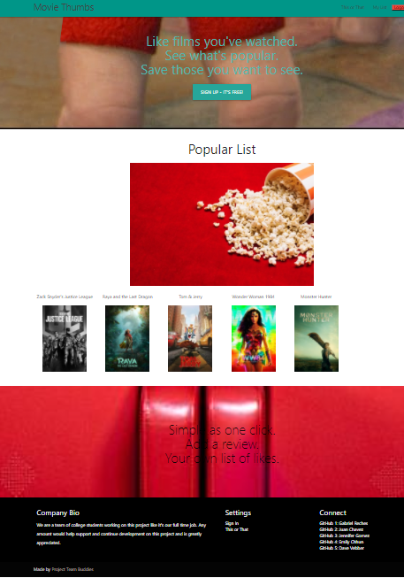
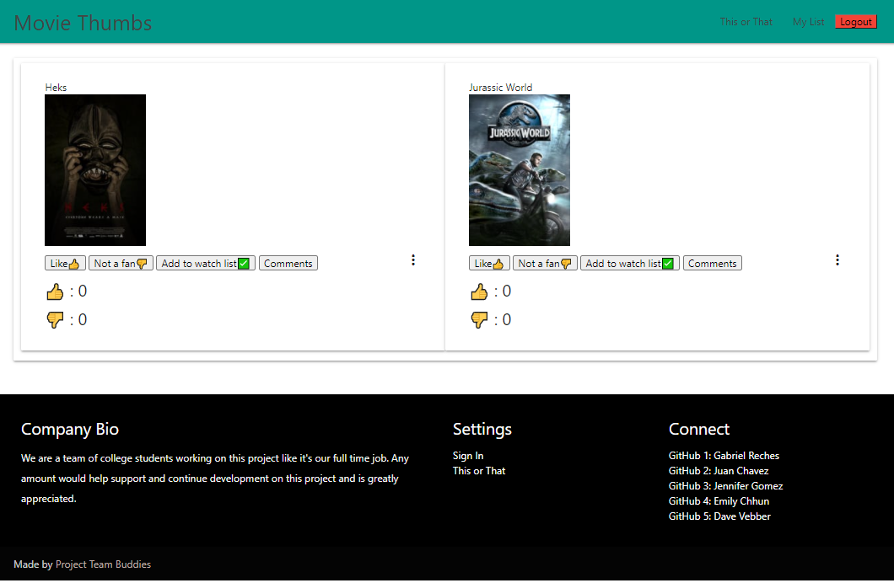

<h1 align="center">✌️🤟🙏👋  Movie Thumbs  ✌️🤟🙏👋</h1>
<h1 align="center">

</h1>

## Description 

  *The what, why, and how:* 
  
  🔍 Movie Thumbs is an application where users can rate movie selections and can add liked movie to their personal list. Some of the information returned from the search includes the movie title, votes, and comments. This will allow users to find their favorite movie to watch, when an user can go to "This or That" page. This application was made to help those movie fanatics pick the right movie at home during COVID-19. 

 *Check out the [ExampleREADME.md](https://github.com/GRech17/Movie-Thumbs) as an example.*
   
 
  ## Table of contents

 - [Tech Used](#tech-used)
 - [Questions](#questions)
 - [Links](#links)
 - [License](#license) 
   

 ## Tech Used
 *Steps required to install project and how to get the development environment running:*
  
💽💽 Installation is a process of installing the dependencies required. Intialize node package manager and then run the following commands:
   
    
 1. Node
 2. Express
 3. MySQL
 4. Sequelize
 5. Dotenv
 6. Handlebars
 7. Bcrypt
 8. express-session
 9. connect-session-sequelize
  
  *Demo*

   View a demonstration of the application:
   
  
  

  

   
  
 
  
  ## Licence
  📝📑
  
  
   
  
 
  ## Contributors
  💆🏽💆🏻‍♂️👳🏽👳🏽👳🏻‍♀️👨🏾‍🦽👨🏿‍🤝‍👨🏾As I use this for my own projects, i want to contribute to everybody such as students, my friends, and other users. I know this might not be the perfect README for all projects out there. If your vision of a perfect README.md differs greatly from mine, tell me what you think and we open an issue. If you'd like to contribute,  please do pull requests and make changes as you'd like. In this case, you can create a new file README-yourplatform.md and create the perfect boilerplate for that.
   
 
 
  ## Test
  🥇 *Tests for application and how to run them:*
 
   There is no test information for this application at this time.
   
 
  ## Questions
   

   *✋For any questions, please contact us with the information below:*
  

 * Find me on GitHub 1: [Gabriel Reches](https://github.com/GRech17)   

* Find me on GitHub 2: [Juan Chavez](https://github.com/jchavezval)
  

* Find me on GitHub 3: [Jennifer Gomez](https://github.com/cleanjenn)
  

 * Find me on GitHub 4: [emilychhun](https://github.com/emilychhun)
  

 * Find me on GitHub 5: [Dave Vebber](https://github.com/davevebber)
 
   

  ## Repo link: [readme-repo-link](https://github.com/GRech17/Movie-Thumbs)
    
   ## Repo link: [readme-repo-link](https://movie-thumbs.herokuapp.com/)
    

